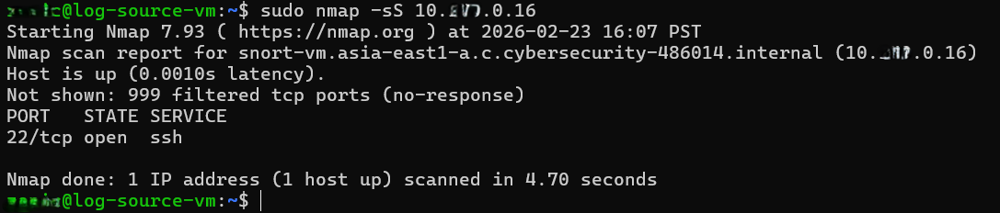
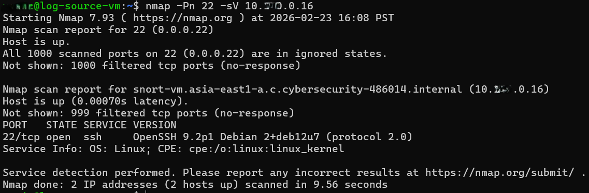
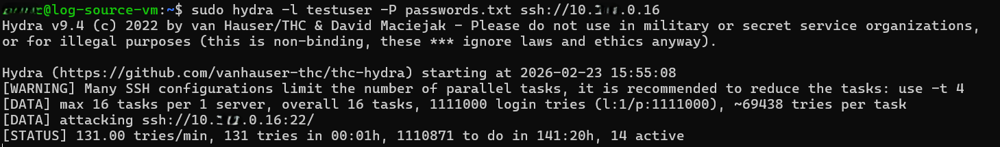
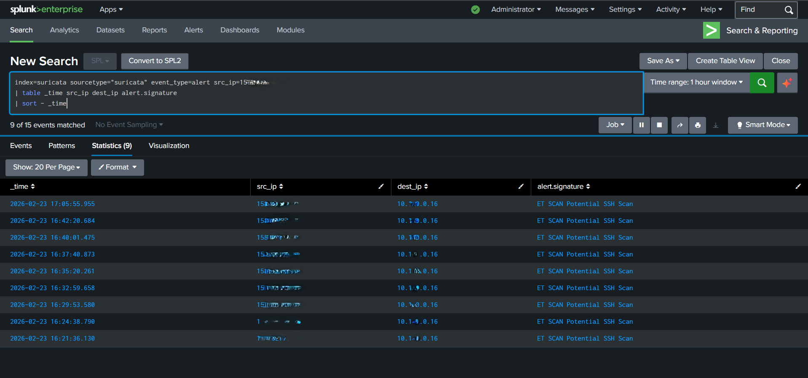
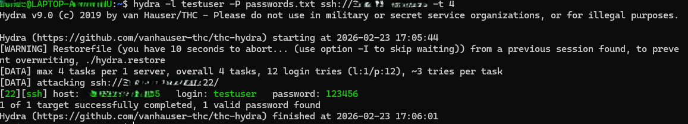
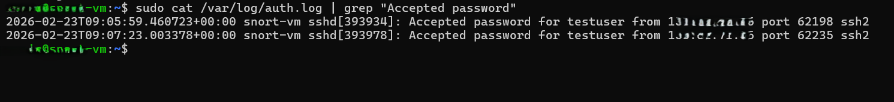
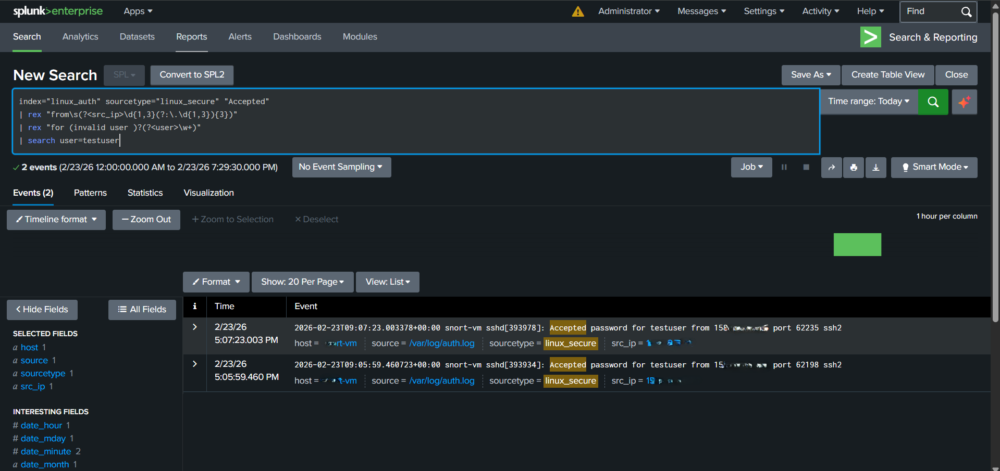
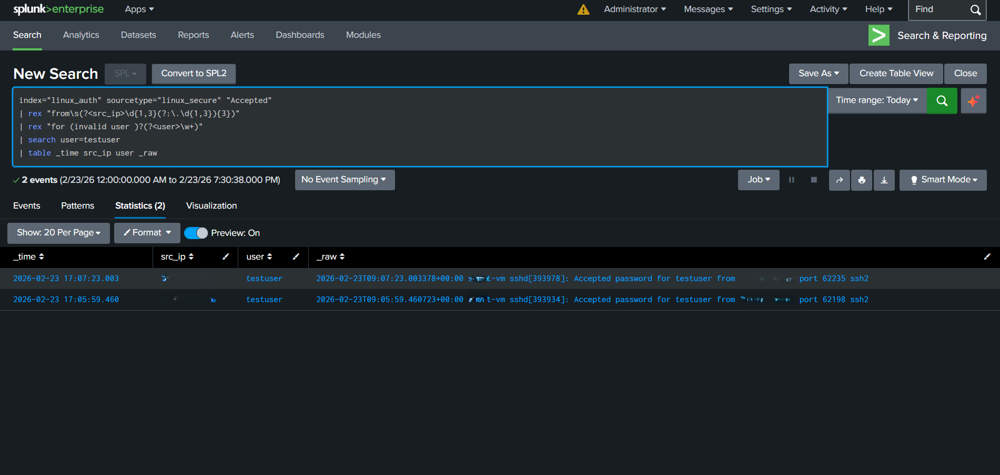

# 🎯 SURICATA TESTING DEMO
Goal is to simulate:
- Recon scan
- SSH enumeration
- Brute-force attempt
- Suricata detection
- Splunk correlation timeline

This mirrors a **real SOC incident chain**.

## 🧭 LAB ROLES
```
| VM            | Role                                 |
| ------------- | ------------------------------------ |
| Attacker VM   | runs scans + brute force (My laptop) |
| Target VM     | SSH server (utilize log-source-vm)   |
| Suricata VM   | IDS sensor (the newly setup vm)      |
| Splunk server | logging + dashboard (splunk-server)  |
```

## ✅ First — verify Suricata is actually inspecting traffic
On the **Suricata VM**, run:
```bash
sudo suricata -T -c /etc/suricata/suricata.yaml -v
```
If OK, then confirm it’s monitoring the correct interface:
```bash
ip a
```
Check the interface name (ex: eth0, ens4, etc.)
Then confirm Suricata is running:
```bash
sudo systemctl status suricata
```
And confirm alerts file updates:
```bash
sudo tail -f /var/log/suricata/fast.log
```
## ✅ Make sure Suricata HAS brute-force detection rules
SSH brute force alerts come from:
- ET Open ruleset
- Usually rule name like:
```code
ET SCAN Potential SSH Scan
ET HUNTING Suspicious SSH BruteForce
ET POLICY SSH Bruteforce attempt
```
Check if rules exist:
```bash
grep -i ssh /var/lib/suricata/rules/*.rules
```
If nothing appears, update rules:
```bash
sudo suricata-update
sudo systemctl restart suricata
```

## ✅ Enable password auth TEMPORARILY (Lab-safe method)
On target VM (log-source-vm), Edit SSH config:
```bash
sudo nano /etc/ssh/sshd_config
```
Change:
```bash
PasswordAuthentication yes
```
Restart SSH:
```bash
sudo systemctl restart ssh
```
Create a fake user for testing:
```bash
sudo adduser testuser
```
Set weak password like:
```bash
123456
```
**Note:** For testing purposes, the SSH port on the target VM was temporarily opened with an allow rule restricted to my laptop’s IP address. After completing the tests, password authentication was disabled again.
To disable password authentication:

```yaml
PasswordAuthentication no
```
Restart SSH.
This keeps your VM secure.

## ✅ Install the necessary tools for attack simulation (Attacker VM)
Install attack tool:
```bash
sudo apt update
sudo apt install hydra -y
```
Hydra is safe for lab brute-force testing.

Install **crunch** for the password list you can also install **wordlist** :
```bash
sudo apt install crunch
```

## ✅ Perform SSH brute-force test (LAB ONLY)

### 🟢 STEP 1 — Reconnaissance (Stage 1 Attack)
From attacker VM:
```bash
nmap -sS TARGET_IP
```
**What this simulates**
Attacker discovering open ports.

**Expected Suricata alerts**
- ET SCAN Nmap detected
- ET SCAN Potential Scan
- SYN scan alerts



### 🟢 STEP 2 — SSH Service Enumeration
From attacker VM:
```bash
nmap -p 22 -sV TARGET_IP
```
**What this simulates?**
Attacker checking:
- SSH version
- service details
- potential vulnerabilities
Expected Suricata alerts
- SSH banner observed
- suspicious SSH probing
- version string alerts



### 🟢 STEP 3 — Brute-Force Simulation
From attacker VM:
```bash
hydra -l testuser -P password.txt ssh://TARGET_VM_IP -t 4
```
**What this simulates?**
Automated password attack.

**Expected Suricata alerts**
1. SSH scan behavior
2. repeated connections
3. brute-force heuristics
4. connection threshold alerts



### 🟢 STEP 4 — Verify detections in Splunk
Search:
```spl
index=suricata event_type=alert
```
Then timeline view:
```spl
index=suricata event_type=alert
| table _time src_ip dest_ip alert.signature
```



### 🟢 STEP 5  — Successful Credential Compromise (Hydra cracked password)
Run Hydra attack from Attacker VM
```bash
hydra -l testuser -P passwords.txt ssh://<target-ip> -t 4 -V
```


Verify the login actually worked (**Target VM**)








